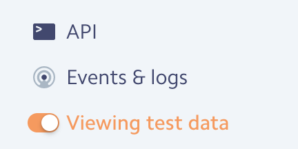
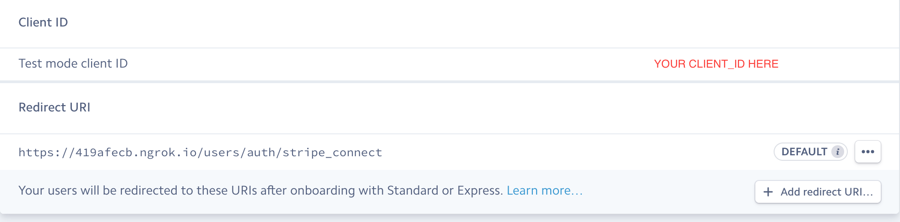

[](https://standardjs.com)

# Cherri 樱桃

## By Golden Lucky Dragon

  #### Coder Academy Sydney
  ####Final Project
  #####by Carmen Chung, Jon Ablondi and James Marotta.

TODO : update ENV For backend FRONT_END_URL

---
###Installation Instructions

  To use this project locally

```
$ git clone https://github.com/GoldenLuckyDragon/Cherri.git
```
Then change into the directory  
```
$ cd Cherri
```
The project is in front and backend lets set up the backend first

you will need a stripe account goto https://dashboard.stripe.com/register
register for an account and in the dashboard sign up for connect.

Stripe connect allows the platform to be a middleman between a transaction of two clients.

Once you have a stripe account register your platform here
https://dashboard.stripe.com/account/applications/settings

now run

```
$ cd backend && touch .env
```
this will move you to the backend folder and create a dotenv file we can save our environment variables inside.

copy and paste the following inside
```
STRIPE_DEV_SECRET=
CLIENT_ID=

```
fill in your Client ID from your stripe dashboard under settings.

Keep the dashboard open as you will need it again.

 update your modules with
```
$ yarn install
```
Stripe requires a handshake verification process which must be done over https and cannot be done on localhost.


Download and install ngrok from
https://ngrok.com/download

This will allow us to overcome this
 cd to the download directory

```
  cd [PATH TO NGROK probably /downloads]
```
and run
```
 $ ngrok http 8080
```

this creates a secure public connection to your localhost


copy the https url and go back to your dashboard
and it as a new redirect_URI

on the bottom left of the dashboard make sure you select test data



Goto your dashboard

add your redirect_uri and make sure to add

```
/users/auth/stripe_connect
```
to the end of your ngrok https url.

it might look something like this
```
https://2221ajecb.ngrok.io/users/auth/stripe_connect

```


now goto click on API on the left of the dashboard and save both your stripe secret key to your new .env file


Dashboard should look like this


Important Note: you must verify your identity on stripe for connect to accept payments


Keep a terminal open inside /backend
and run
```
$ yarn start
```
 you should see
 ```
 Server running on port: 8080
 Successful connection to MongoDB
 ```


If you do not already have MongoDb, you will need to install it with the following steps.

---
### MongoDb

open a new Terminal window with <kbd>CMD</kbd> + <kbd>T</kbd>

We use MongoDb, with this project you can install it using homebrew.

You can find the MongoDb docs [here](https://docs.mongodb.com/manual/tutorial/install-mongodb-on-os-x/)

First update your homebrew with

```
$ brew update
```

then run
```
$ brew install mongodb
```
once the installation is complete run

```
$ mongod --dbpath /usr/local/var/mongodb
```

a Successful connection will display
```
waiting for connections on port 27017
```


---


#### Setting Up The Front End

In a new terminal window (keep the other windows open)
 <kbd>CMD</kbd>  + <kbd>T</kbd>

now type
```
$ cd ..
```
to go back a folder and then
```
$ cd frontend
```
to move to the front end folder.

make a new .env file with

```
$ touch .env
```

copy the following inside

```
REACT_APP_STRIPE_DEV_PUBLISH=
REACT_APP_SERVER_URL=http://localhost:8080
```
Fill in the STRIPE_DEV_PUBLISH with your test publishable key from your stripe dashboard.

now run
```
$ yarn install
```

You should have 3 terminal windows in total

*1.* Cherri/backend running.

*2.* mongodb running.

*3.* cherri/frontend


and then
```
$ yarn start
```
to start the website.


---
---
### linter [](https://standardjs.com)

  We chose to use https://standardjs.com/

  It is well documented, it has auto enforcement on save and it works with es6.

  Controversally it removes semicolons but we figure this to be they way of the future anyway.
  Because of this, you can never start a line with (, [, or `
