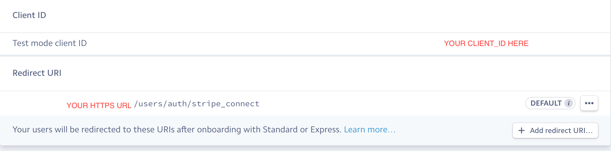

[](https://standardjs.com)

# Cherri 樱桃

### Node / React.js Project
#### By Golden Lucky Dragon
##### (Carmen Chung, Jon Ablondi and James Marotta).

#### Coder Academy Final Work


## TABLE OF CONTENTS

[1. INSTALLATION INSTRUCTIONS](#installation)

[2. HOW TO DEPLOY](#deployment)

[3. TOOLS & METHODOLOGIES](#tools)

[4. BUSINESS PROBLEM](#businessproblem)

[5. BUSINESS SOLUTION](#businesssolution)

[6. PROJECT PLANNING](#businesssolution)
* [User Stories](#userstories)
* [Workflow Diagram & Project Plan](#workflow)
* [Wireframes](#wireframes)
* [Entity Relationship Diagram (ERD)](#erd)

[7. KEY FEATURES](#keyfeatures)

[8. FURTHER WORK](#furtherwork)

[9. LICENSE](#LICENSE)

---
<a name="installation"/>

### 1. Installation Instructions

</a>

To use this project locally:

```
$ git clone https://github.com/GoldenLuckyDragon/Cherri.git
```
Move into the directory:  
```
$ cd Cherri
```
The project consists of both a front and back end.

---

#### Back End
To begin with, you will need a stripe account. Go to  https://dashboard.stripe.com/register
and register an account. In the Stripe dashboard, sign up for Stripe Connect (which allows the platform to be a middleman in a transaction between two clients).

Once you have a Stripe account, register your platform here:
https://dashboard.stripe.com/account/applications/settings

Important Note: you must verify your identity on Stripe for Stripe Connect to accept payments.

In Terminal, move into the backend folder and create a dotenv file that will host your environment variables.

```
$ cd backend && touch .env
```

Copy and paste the following inside the dotenv file:
```
STRIPE_DEV_SECRET=
CLIENT_ID=

```
Fill in your Client ID from your Stripe dashboard under Settings (and keep your dashboard open, as it will be used again).

Update your modules with the following command in Terminal:
```
$ yarn install
```
Stripe requires a handshake verification process which must be done over https and cannot be done on localhost. As such, download and install ngrok from
https://ngrok.com/download (which will facilitate the handshake verification).

Move to the download directory with the following Terminal command:

```
  cd [PATH TO NGROK - likely to be "/downloads"]
```
and run the following command to create a secure public connection to your localhost:
```
 $ ngrok http 8080
```


Then copy the https url and go back to your Stripe dashboard. There will be a new redirect_URI on the bottom left of the dashboard. Select "Viewing test data" as per below:


Go to your dashboard - when you add your redirect_URI, make sure to add the following to the end of your ngrok https url:

```
/users/auth/stripe_connect
```

It might look something like this:
```
https://2221ajecb.ngrok.io/users/auth/stripe_connect

```

Then click on "API" on the left of the dashboard and save both your stripe secret key to your new .env file. The dashboard should look like this:



Keep Terminal open inside the /backend folder
and run:
```
$ yarn start
```
You should see:
 ```
 Server running on port: 8080
 Successful connection to MongoDB
 ```

If you do not already have MongoDb, you will need to install it with the following steps.

---
#### MongoDb

Open a new Terminal window with <kbd>CMD</kbd> + <kbd>T</kbd>

We use MongoDb - with this project you can install it using Homebrew.

You can find the MongoDb docs [here](https://docs.mongodb.com/manual/tutorial/install-mongodb-on-os-x/).

First update your homebrew with the following:

```
$ brew update
```

Then run:
```
$ brew install mongodb
```
Once the installation is complete, run:

```
$ mongod --dbpath /usr/local/var/mongodb
```

A successful connection will display as follows:
```
waiting for connections on port 27017
```

---

#### Front End

Open a new Terminal window (keep the other windows open) by pressing
 <kbd>CMD</kbd>  + <kbd>T</kbd>

Now type:
```
$ cd ..
```
to go back a folder and then:
```
$ cd frontend
```
to move to the front end folder.

Make a new .env file by entering in Terminal:

```
$ touch .env
```

and copy the following inside:

```
REACT_APP_STRIPE_DEV_PUBLISH=
REACT_APP_SERVER_URL=http://localhost:8080
```
Fill in the STRIPE_DEV_PUBLISH with your test publishable key from your stripe dashboard; then run:
```
$ yarn install
```

You should have 3 terminal windows running:

*1.* Cherri/backend.

*2.* Mongodb.

*3.* Cherri/frontend.

Type into Terminal:
```
$ yarn start
```
to start the website.

---
<a name="deployment"/>

###2. HOW TO DEPLOY

You will need accounts with the three following websites.

M-lab   
https://mlab.com/home

Zeit  
https://zeit.co/

Netlify   
https://www.netlify.com/


#####Back to front.
First we submit our mongo DB up to m-lab.

  Sign In and create a new db with the button on the right
  in the selection screen select AMAZON WEB Service
  and then select sandbox, push continue.

  

  Select US east for region and push continue.

  

  You will see a confirmation page, double check your details and confirm you are using the free tier.

  


  #####Zeit

  To install the Cli tools, run:

  ```
  $  npm install -g now
  ```

  type

  ```
  $ now login
  ```
  you will need to login, and verify your identity via email.

  read more about now from Zeit, [here](https://github.com/zeit/now-cli)

  To send your codebase to zeit,

  from yourproject/backend run

  ```
  $ npm install
  ```

  now doesn't like Yarn install and you will have errors please use npm install

  duplicate your .env file and rename to .env.production

  ```
  mv .env .env.production
  ```
  then run

  ```
  now -E .env.production --public
  ```

  this will send your .env to zeit, be sure to check our [Installation steps](#installation) to be sure you have the right keys in the file.

  the --public will allow you to skip a confirmation that if using the free version of Zeit your code will be made public.


---
<a name="tools"/>

### 3. TOOLS & METHODOLOGIES

</a>

### Linter  [](https://standardjs.com)

We chose to use the following Linter: https://standardjs.com/

It is well documented, it has auto enforcement on save and it works with es6. Controversially, it removes semicolons, but this appears to be becoming standard practice in the industry. As a result, you can never start a line with (, [, or `

---
<a name="businessproblem"/>

### 4. BUSINESS PROBLEM

</a>

Our client, Winsome Stock, seeks to create an online web application platform where manufacturers can create an account to upload their unpaid invoices (up to a limit of US$3 million), proof of delivery documents (signed by their end customer) and a signed Account Receivables Sale & Purchase Agreement. These documents can then be reviewed by Winsome Stock, which can immediately purchase the unpaid invoices at a specified percentage of the invoice value. While we understand that in the future, Winsome Stock would prefer to set the percentage based on the risk profile of the manufacturer and its end customer, it is agreed that the current iteration of the platform will set the purchase amount at 90% of the invoice value.

Ideally, verification of both the manufacturer and the invoice authenticity would be done online through automated systems implemented on the platform (for example, through document recognition software), but the current iteration of this project will require Winsome Stock to conduct its own verification process offline, external to the platform (for example, by calling end-customers to request confirmation of the invoice’s authenticity).
